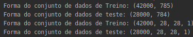
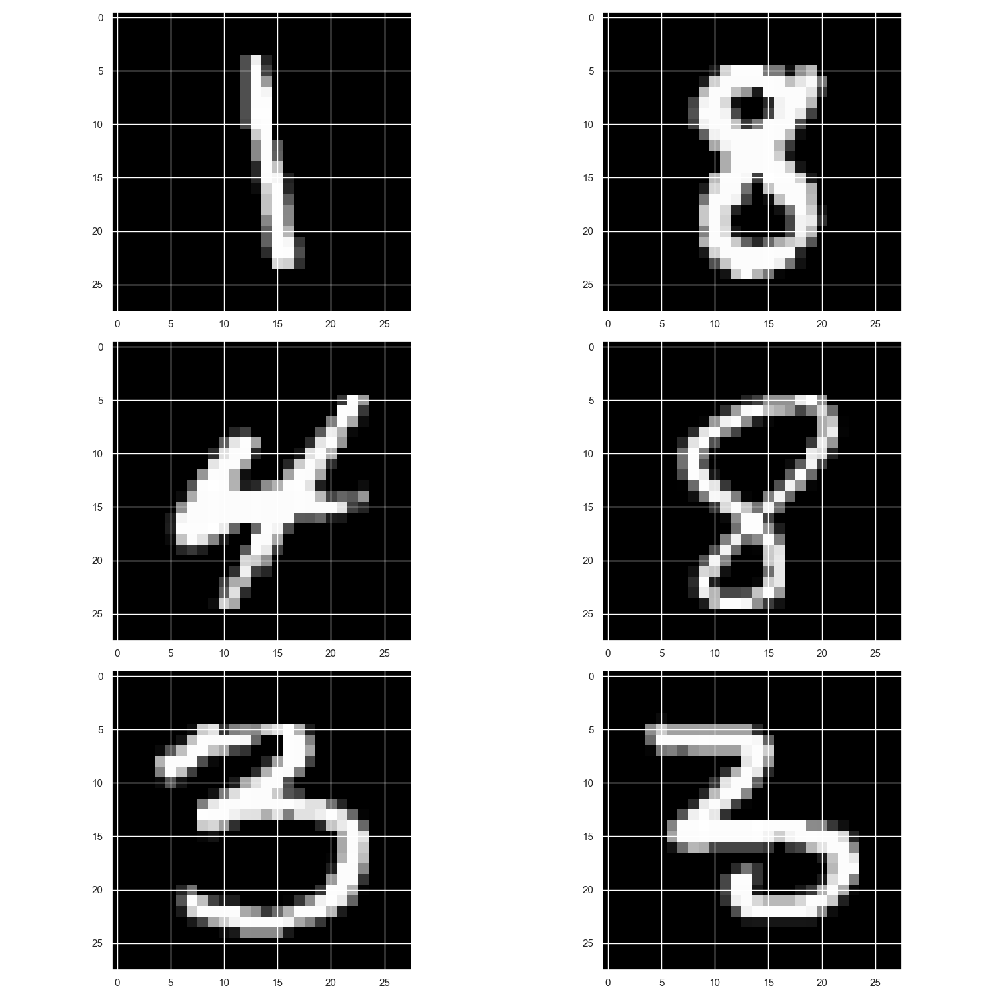

<h1 align="center">Prediction Competition with the famous MNIST data</h1>

Competition Description
==============

MNIST ("Modified National Institute of Standards and Technology") is the de facto “hello world” dataset of computer vision. Since its release in 1999, this classic dataset of handwritten images has served as the basis for benchmarking classification algorithms. As new machine learning techniques emerge, MNIST remains a reliable resource for researchers and learners alike.

In this competition, your goal is to correctly identify digits from a dataset of tens of thousands of handwritten images. We’ve curated a set of tutorial-style kernels which cover everything from regression to neural networks. We encourage you to experiment with different algorithms to learn first-hand what works well and how techniques compare.

Practice Skills
=========

>Computer vision fundamentals including simple neural networks

>Classification methods such as SVM and K-nearest neighbors

Project   :octocat:
========

**How to use**

1. Clone the repository `git clone https://github.com/nunesdaniel/digit_recognizer`

>If necessary download the dataset [MNIST](https://www.kaggle.com/c/digit-recognizer/data) and move the files `train.csv` and `test.csv` to path `data`

2. Install the dependencies `pip install -r requeriments.txt`

3. Run the file `cnn.py`

**Results**

The shape of dataset

Data sample

</img>

Summary

Results for class

Plots

</img>

Predictions

Licence  :page_facing_up:
=======

This project is under license MIT. For more details visit [LICENSE](LICENSE.md).

---

By Daniel Nunes :wave: [danielnunesdc](https://github.com/danielnunesdc)
